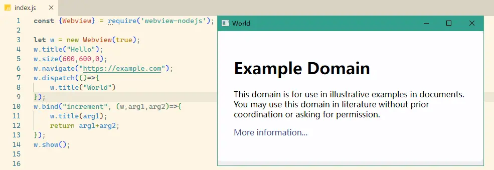

# webview-nodejs


[](https://www.npmjs.com/package/webview-nodejs)


[](https://app.fossa.com/projects/git%2Bgithub.com%2FWinterreisender%2Fwebview-nodejs?ref=badge_shield)

English | [中文(简体)](docs/README.zh-Hans.md)

A Node.js binding and wrapper for [webview](https://github.com/webview/webview), a tiny cross-platform webview library to build modern cross-platform desktop GUIs using WebKit (Gtk/Cocoa) and Edge (Windows).



## Getting Started

1. Install via npm

```shell
npm i webview-nodejs
```

2. Import and use webview

```js
const { Webview } = require('webview-nodejs');

let w = new Webview();
w.title("Hello World");
w.size(800,600);
w.navigate("https://example.com");
w.show();
```

For more examples like interacting between Node.js and webview and more detailed instructions see [Tutorial](https://github.com/Winterreisender/webview-nodejs/wiki/Tutorial).

## Help

- [Tutorial](https://github.com/Winterreisender/webview-nodejs/wiki/Tutorial)
- [Documentation](https://winterreisender.github.io/webview-nodejs/tsdoc/index.html)
- [Examples](test/)
- [webview.dev](https://webview.dev/)
- [Limitations and Workarounds](https://github.com/Winterreisender/webview-nodejs/wiki/Limitations-and-Workarounds)

## Supported Platforms

Build-in support:

- win32 x64
- linux x64
- osx x64
- osx aarch64

By loading lib manully, other architectures could be supported, you could find them [here](https://github.com/Winterreisender/webview-xmake/releases). Only windows-x64 and linux-x64 are tested.

For more information, see [Prerequisites](https://github.com/Winterreisender/webview-nodejs/wiki/Tutorial#prerequisites).

## Contribution

All suggestions, pull requests, issues and other contributions are welcome and appreciated.

## Credits

| Project                                                                   | License                                                                             |
| ------------------------------------------------------------------------- | ----------------------------------------------------------------------------------- |
| [webview](https://github.com/webview/webview)                                | [MIT](https://github.com/webview/webview/blob/master/LICENSE)                          |
| [webview_deno](https://github.com/webview/webview_deno)                      | [MIT](https://github.com/webview/webview_deno/blob/master/LICENSE)                     |
| [node-ffi-napi](https://github.com/node-ffi-napi/node-ffi-napi)              | [MIT](https://github.com/node-ffi-napi/node-ffi-napi/blob/master/LICENSE)              |
| [Microsoft Webview2](https://www.nuget.org/packages/Microsoft.Web.WebView2/) | [BSD-style](https://www.nuget.org/packages/Microsoft.Web.WebView2/1.0.1245.22/License) |

# License

Copyright 2022 Winterreisender and [other contributors](https://github.com/Winterreisender/webview-nodejs/graphs/contributors).

Licensed under the Apache License, Version 2.0 (the "License"); you may not use this file except in compliance with the License. You may obtain a copy of the License at http://www.apache.org/licenses/LICENSE-2.0
Unless required by applicable law or agreed to in writing, software distributed under the License is distributed on an "AS IS" BASIS, WITHOUT WARRANTIES OR CONDITIONS OF ANY KIND, either express or implied.
See the License for the specific language governing permissions and limitations under the License.

SPDX short identifier: **Apache-2.0**


